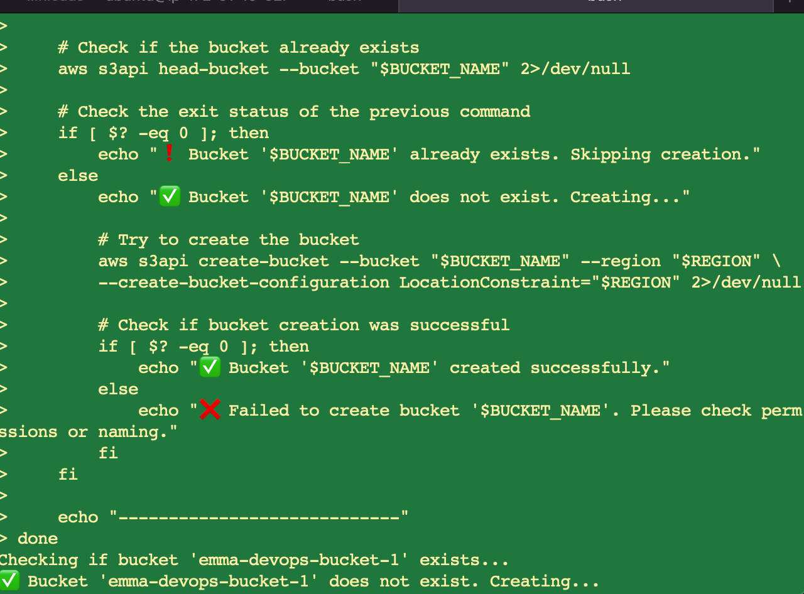
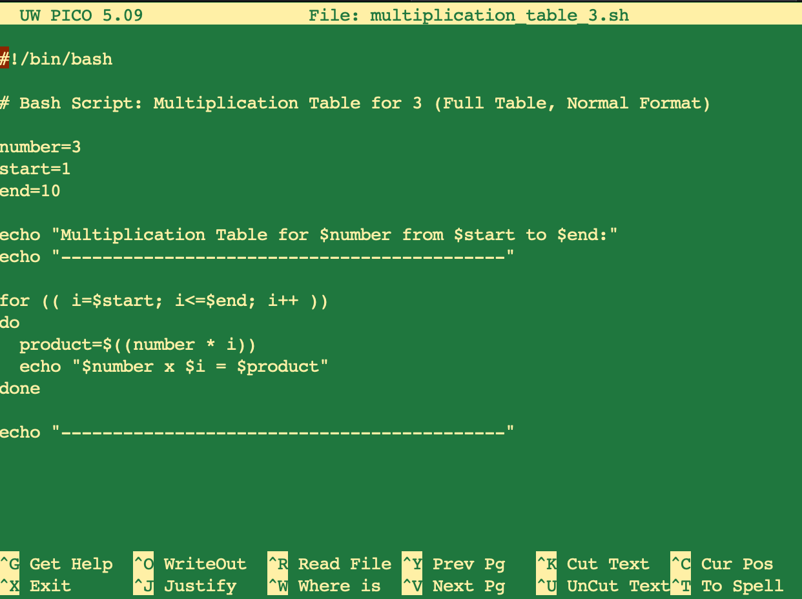
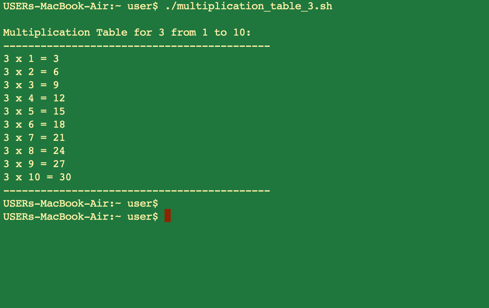

> # Bash-script

Bash Script For Generating a Multiplication Table 
Objective: Create a Bash script that generates a multiplication table for a number entered by the user. This project will help you practice using loops, handling user input, and applying conditional logic in Bash scripting. 
Project Description 
Your script should prompt the user to enter a number and then ask if they prefer to see a full multiplication table from 1 to 10 or a partial table within a specified range. Based on the user's choice, the script will display the corresponding multiplication table. 
Project Requirements 
User Input for Number: The script must first ask the user to input a number for which the multiplication table will be generated. 
Choice of Table Range: Next, ask the user if they want a full multiplication table (1 to 10) or a partial table. If they choose partial, prompt them for the start and end of the range. 
Use of Loops: Implement the logic to generate the multiplication table using loops. You may use either the list form or C-style for loop based on what's appropriate. 
Conditional Logic: Use if-else statements to handle the logic based on the user's choices (full vs. partial table and valid range input). 
Input Validation: Ensure that the user enters valid numbers for the multiplication table and the specified range. Provide feedback for invalid inputs and default to a full table if the range is incorrect. 
Readable Output: Display the multiplication table in a clear and readable format, adhering to the user's choice of range. 
Comments and Code Quality: Your script should be well-commented, explaining the purpose of different sections and any important variables or logic used. Ensure the code is neatly formatted for easy readability. 
Example Script Flow: 
1. Prompt the user to enter a number for the multiplication table. 
2. Ask if they want a full table or a partial table. If partial, prompt for the start and end numbers of the range.
 3. Validate the range inputs and handle invalid or out-of-bound entries.
 4. Generate and disolav the multiplication table accordina to the specified ranae. 
6. Enhanced User Interaction: Incorporate additional checks or features, like repeating the program for another number without restarting the script. 
7. Creative Display Options: Offer different formatting styles for the table display and let the 
user choose. 

 

 

 

 

 ![](./Images/5.png
 
 
 
 
 